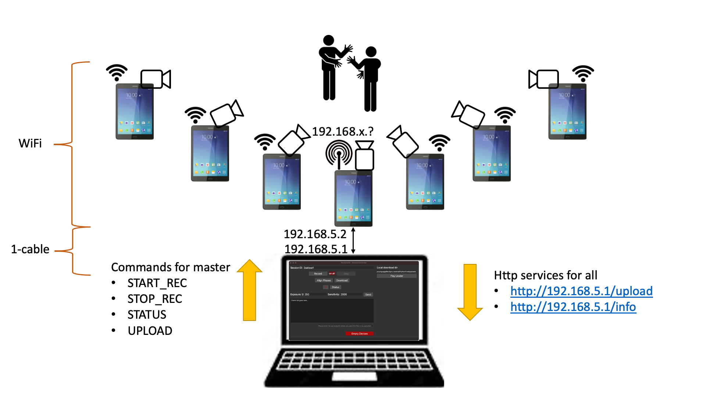
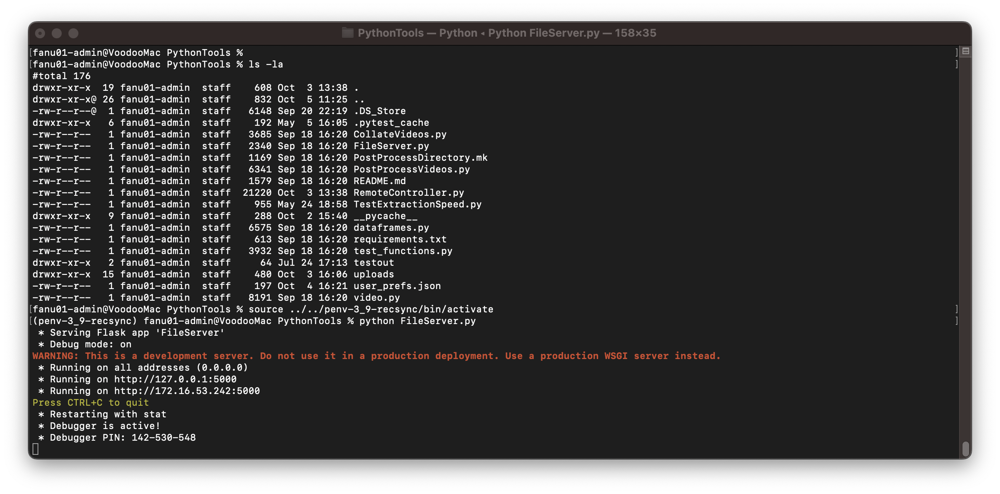
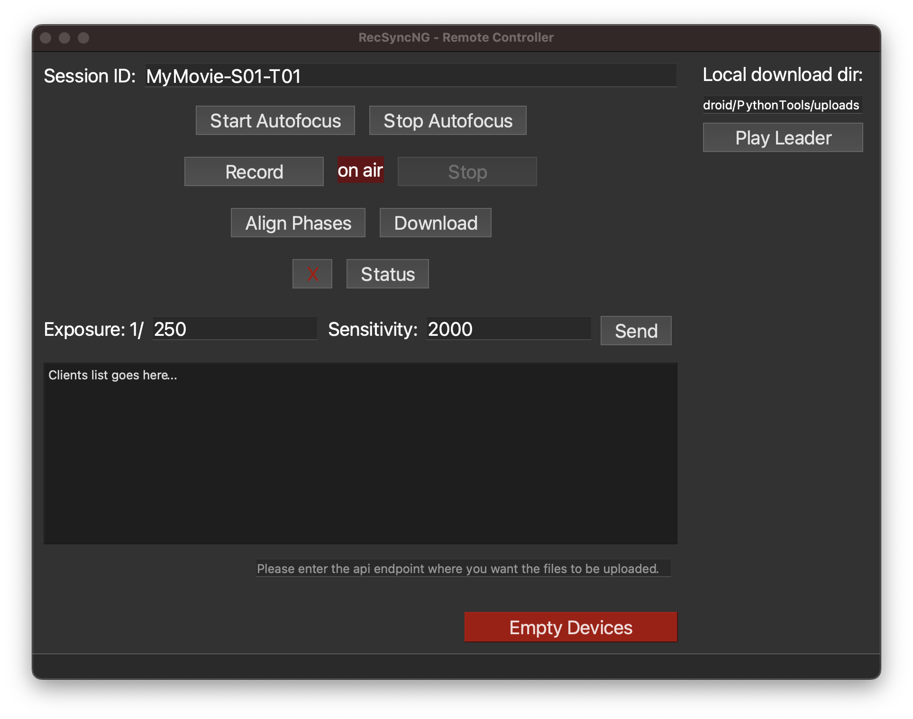

# RecSyncNG

RecSyncNG is a video recording app with sub-millisecond synchronization accuracy for multiple Android smartphones,
useful for creating affordable and easy-to-setup multi-view camera systems for robotics, SLAM, 3D-reconstruction, panorama stitching.

RecSynchNG is a fork of the original [RecSynch-android](https://github.com/MobileRoboticsSkoltech/RecSync-android) project. Here is the [original README](README-orig.md).

The original project has been improved with a remote GUI allowing for remote control of the android devices, centralized video download capability,
 and a revised post-processing stage for the deployment of perfectly synchronized videos.

## Concept

The folowing picture depicts the organization of a recording setup.



A set of Android devices act as "remote controlled cameras".
One device acts as "Leader" and is configure as HotSpot sharing its ethernet connection.
All other devices act as "Clients" and connect to the HotSpot WiFi network. No cables are needed.
The only cabled connection is between the Leader and a controlling desktop machine.
On the controlling machine runs a Remote Controller (together with a small http file server), which allows for the full management of the camera settings, recording control, and file download.

## Installation and setup

### Requirements

* A set of Android devices, _all of the same hardware type_, with Android version 10+. (We were able to compile and run on Android 8, but not tested since a while)
* Elect a _Leader_ android device:
  * must have an adaptor for Ethernet connection;
  * must be able to configure the ethernet with static IP address;
  * must be able to configure Hotspot (share Ethernet via WiFi):
    * not all devices can by default enable Hotspot without a SIM card. To circumvent some limited GUIs, we are using the `VPNHotspot` app.
* A laptop/PC with Python 3.9 and an ethernet adaptor

### Android devices installation and setup

* Install the RecSynchNG apk on all devices
* Go to the settings of your Android device `Settings -> Apps -> RecSynch`
  * and give permission to use `Camera` and `Files and Media`
* Select one device as _Leader_:
  * configure its Ethernet adaptor with:
    * Static IP: 192.168.5.2
    * Mask: 255.255.255.0
    * DNS: 192.168.5.1
    * Gateway: 192.168.5.1
  * Start a Wi-Fi hotspot, sharing the Ethernet connection.
* Connect all other android devices to the Hotspot WiFi network.

The master app should display now the connected clients and buttons for recording control


### Remote controlling PC installation and setup

Configure the ethernet adaptor of your PC as: 
* Static IP: 192.168.5.1
* Mask: 255.255.255.0
* Gateway 192.168.5.1

Connect via a physical ethernet cable the PC to the Master device.

Verify the Ethernet connection with Ping. E.g., from the PC, in a terminal

```
> ping 192.168.5.2

64 bytes from 192.168.5.2: icmp_seq=347 ttl=125 time=2.425 ms
64 bytes from 192.168.5.2: icmp_seq=348 ttl=125 time=2.233 ms
64 bytes from 192.168.5.2: icmp_seq=349 ttl=125 time=7.560 ms
64 bytes from 192.168.5.2: icmp_seq=350 ttl=125 time=2.288 ms
```


Setup a python environment using Python 3.9+.

```
cd path/to/RecSyncNG/PythonTools
python3 -m venv p3env-RecSynchNG
source p3env-RecSynchNG/bin/activate
pip install -r requirements.txt
```

For the post-processing of the videos, you need to install ffmpeg executable. E.g.:
* On Linux: `apt install ffmpeg`
* On Mac: `brew install ffmpeg`


## Usage

### Run the software

(Android) First, start the app on all Android devices:
* Wait a few seconds for synchronization;
* on client devices you should see the client ID and info about the connection status; 
* on the leader device you should see the list of connected clients.

TODO -- add screenshot(s)


Second, start the software on the controlling PC.

On one terminal **start the http file server**. It starts a small http server ready to receive the recorded files from the android devices:

```
cd path/to/RecSyncNG/PythonTools
source p3env-RecSynchNG/bin/activate
python FileServer.py
```

This server will store files in a directory `PythonTools/uploads`.




In another terminal, **start the remote controlling GUI** :

```
cd path/to/RecSyncNG/PythonTools
source p3env-RecSynchNG/bin/activate
python RemoteController.py
```




### Recording video

Using the GUI displayed on the device (original instructions):

1.  [Optional step] Press the ```calculate period``` button. The app will analyze frame stream and use the calculated frame period in further synchronization steps.
2.  Adjust exposure and ISO to your needs.
3.  Press the ```phase align``` button.
4.  Press the ```record video``` button to start synchronized video recording.
5.  Get videos from RecSync folder in smartphone root directory.

Using the Remote Controller (life is easier when sitting at your desk):

1. Set a `prefix` for your recording, like a name followed by a _Scene_ and _Take_ numbers.
2. Click on `Status` to verify if the leader device is properly connected and all clients available. 
3. On the Remote Controller, set the `Exposure` and `Sensitivity` parameters and click `Send`.
4. Start the autofocus to let the camera focus on your target. Stop the autofocus to fix the recording focal length.
5. **Important** before the first recording, and to repeat maybe every couple of minutes, click `Align Phases`. This will ask each device to synchronize the shutters and record in synch.
  * **Important** Wait for 5 seconds for the alignment to finish. There is no feedback for the alignment to be completed, so if you start recording when the alignment is still in progress, your videos might be misaligned!
6. Click `Record` to ask all devices to start recording.
7. Click `Stop` to stop your recording.
8. Click `Download` to receive on the local machine all the videos starting with the given `prefix`. 

You can now optionally click on `Play Leader` to open your local video player and verify that the recording went well.
To do so, you must first manually copy/paste the path to the upload directory in the text area above. (This procedure will be improved in future versions).

### Extraction and matching of the frames

TODO


## Citations / Credits

If you use this application, please cite [Sub-millisecond Video Synchronization of Multiple Android Smartphones](https://arxiv.org/abs/2107.00987):
```
@misc{akhmetyanov2021submillisecond,
      title={Sub-millisecond Video Synchronization of Multiple Android Smartphones}, 
      author={Azat Akhmetyanov and Anastasiia Kornilova and Marsel Faizullin and David Pozo and Gonzalo Ferrer},
      year={2021},
      eprint={2107.00987},
      archivePrefix={arXiv},
      primaryClass={cs.CV}
}
```

This work is based on "Wireless Software Synchronization of Multiple Distributed Cameras"

Reference code for the paper
[Wireless Software Synchronization of Multiple Distributed Cameras](https://arxiv.org/abs/1812.09366).
_Sameer Ansari, Neal Wadhwa, Rahul Garg, Jiawen Chen_, ICCP 2019.
